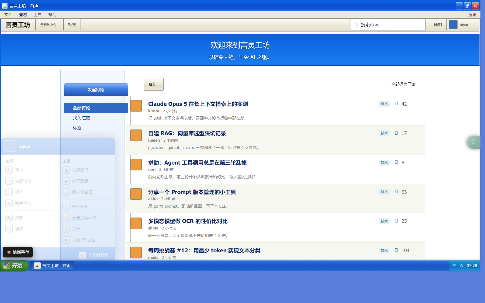
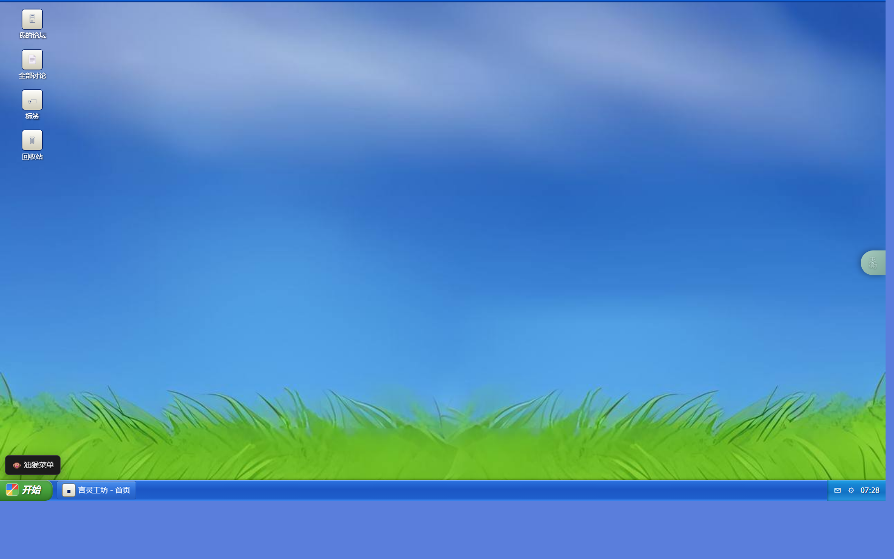
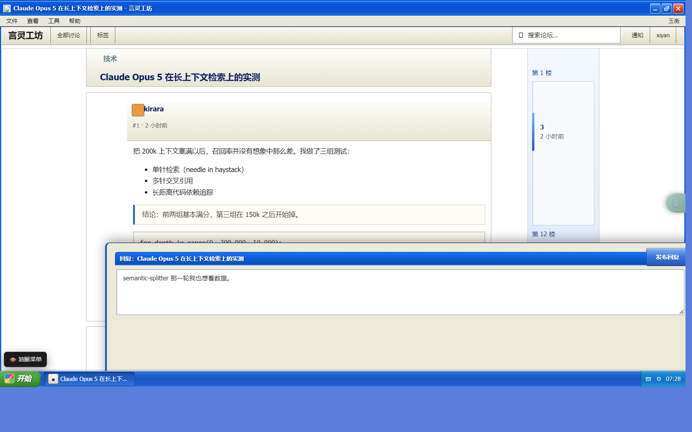
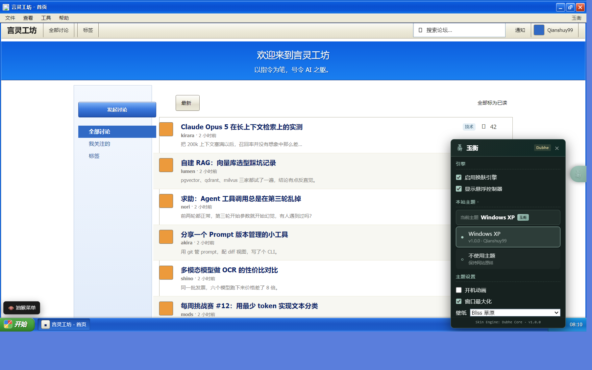
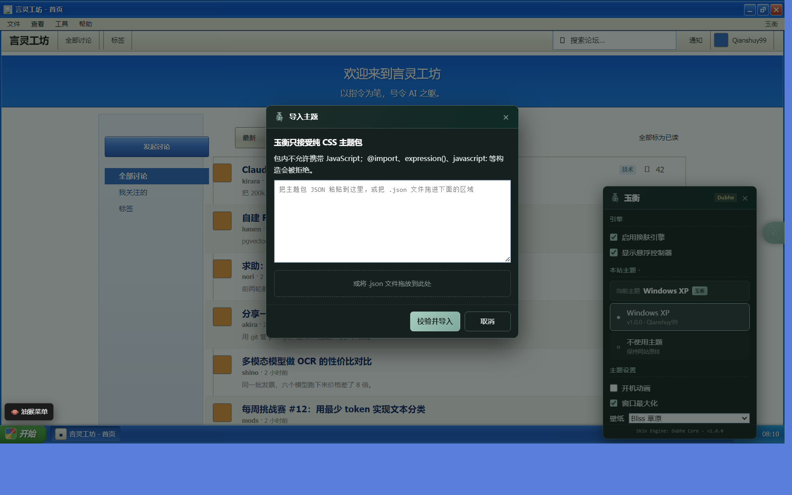

# 玉衡主题助手（YuHeng）

玉衡是一个面向网站的 Userscript 主题管理器。它在匹配的网站上提供一个青瓷绿的悬浮控制器，用于选择、配置、导入和导出主题；未匹配网站则在 `document-start` 立即退出，不注入 DOM 或样式。

项目由三个边界清晰的部分组成：

- **玉衡外壳**：负责主题选择、设置、导入导出和用户反馈。
- **Dubhe Core**：负责主题注册、`@match` 匹配、注入、卸载与数据校验。
- **主题包**：负责目标网站的视觉与受控交互。仓库内置 Windows XP Luna 主题，适用于 AICue 的 Flarum 站点。

玉衡面板中的“官方主题库”固定读取本仓库 [`themes/catalog.json`](themes/catalog.json)，只安装该目录登记且位于同一 GitHub 仓库下的纯 CSS 主题包。下载后的包仍须通过本地安全校验；它与手工导入的包一样可删除。

[](https://cdn.jsdelivr.net/gh/Qianshuy99/yuheng@main/dist/yuheng.user.js)
[](LICENSE)
[](https://qianshuy99.github.io/yuheng/)


```
玉衡（外壳 / 管理器）  ──  Dubhe Core（引擎）  ──  主题包（被管理的内容）
   #yh-shell 作用域              store/registry           html.yh-theme-<id> 作用域
   青瓷绿 #A8CCC0                injector/validate        XP 自己是 Luna 蓝
```

## 适用范围

| 项目 | 当前状态 |
| --- | --- |
| 内置主题 | Windows XP Luna |
| 内置匹配站点 | `*.aicue.top` |
| 脚本管理器 | Tampermonkey、Violentmonkey |
| 可导入主题 | 纯 CSS JSON 主题包，不执行第三方 JavaScript |
| 浏览器 | 支持现代 Userscript API 的桌面浏览器 |

## 安装

完整的安装、使用、导入主题与主题制作说明见 [玉衡使用说明](https://qianshuy99.github.io/yuheng/)。

1. 浏览器装 [Tampermonkey](https://www.tampermonkey.net/)（或 Violentmonkey）。
2. 点上面的安装按钮，或直接打开
   [dist/yuheng.user.js](dist/yuheng.user.js) 的
   [raw 链接](https://cdn.jsdelivr.net/gh/Qianshuy99/yuheng@main/dist/yuheng.user.js)。
3. 访问 [aicue.top](https://www.aicue.top/) 或其匹配子站点；右侧会出现青瓷绿的悬浮球。点开面板后即可选择主题。

`Ctrl+Alt+X` 可快速启用或关闭 XP 主题；油猴菜单也提供主题开关、开机动画与壁纸命令。未注册主题的网站不会显示悬浮球，也不会修改页面。

## 内置的 XP 主题都有什么

| | |
| --- | --- |
|  | **窗口外壳**：蓝色渐变标题栏（最小化/最大化/关闭）、文件-查看-工具-帮助 菜单栏，论坛 header 变成窗口工具栏。标题栏双击最大化/还原。 |
|  | **任务栏与开始菜单**：绿色「开始」按钮、任务按钮、托盘（通知/关于/时钟）。开始菜单读当前登录用户的头像与用户名。 |
|  | **桌面**：最小化后露出壁纸和「我的论坛 / 全部讨论 / 标签 / 回收站」图标，双击可用；右键有 XP 风格菜单。三种壁纸（Bliss 草原用真图，Luna 深蓝与经典纯色是纯 CSS）。 |
|  | **讨论页**：`.DiscussionPage-nav`（Scrubber + 回复/关注）做成同一套 XP 任务窗格，Scrubber 轨道点阵底纹；回复框 `.Composer-header` 是从底部升起的 XP 窗口标题栏。 |
|  | **玉衡面板**：本站主题选择、主题设置项、导入/导出、删除导入包。 |
|  | **导入主题**：粘贴 JSON 或拖文件，过校验后在确认页列出站外域名。 |

其余状态（开机动画、还原、关于框、切换站点框）在 [assets/screenshots/](assets/screenshots/)。

## 开发与发布

```bash
npm install          # 安装构建与预览依赖
npm run assets        # 可选：重新生成图标与壁纸 base64（需要 Python + Pillow）
npm run build         # 生成 dist/yuheng.user.js 与 dist/manifest.json
```

本地预览与回归命令：

```bash
npm run preview       # 生成 preview/skin.js，浏览器打开 preview/index.html
npm run check         # 无头 Chrome 执行 preview/selfcheck.html 的行为断言
npm run shots         # 无头 Chrome 生成视觉回归图到 preview/shots/
```

`preview/index.html` 支持 hash 钩子驱动 UI，方便看单个状态：
`#boot` `#start` `#min` `#restore` `#panel` `#import` `#about` `#site`，
加 `?reset` 清空模拟存储回到首次安装状态。

### 发布清单

`dist/yuheng.user.js` 是**入库的发布产物**：`@downloadURL` 指向它，脚本管理器也据此更新。任何 `src/`、构建脚本或元数据变更，都必须先执行 `npm run build` 并提交更新后的 `dist/` 文件；否则安装链接仍会提供旧实现。

提交前执行 `npm run check`。涉及 UI、布局或主题样式时，再执行 `npm run shots` 并确认关键状态。`assets/screenshots/` 保存从视觉回归结果中挑选的项目截图，README 和 GitHub Pages 文档均依赖这些图片。

推送到 `main` 后，CI 会重新构建并检查 `dist/yuheng.user.js` 是否与源码一致；文档、logo 或截图改动会触发 GitHub Pages 部署，站点地址为 [qianshuy99.github.io/yuheng](https://qianshuy99.github.io/yuheng/)。

## 为什么敢用 `@match *://*/*`

`GM_getValue` 在 Tampermonkey 里是**同步**的，所以 [main.js](src/main.js) 能在
`document-start` 读一次配置、一次主题列表，用 `@match` 模式判断本站有没有主题；
没有就只注册油猴菜单，不碰 DOM、不注入 CSS、不建外壳。没有主题的站点上，整个
脚本的开销就是那两次读取。这个早退是全站匹配能被接受的前提，改元数据前先看
`main.js`。

## 主题契约

制作内置主题或可导入 CSS 主题前，请先阅读 [主题开发规范](主题开发规范.md)；GitHub Pages
也提供从零开始的 [主题制作指南](https://qianshuy99.github.io/yuheng/#themes)。

CSS-only 包就是这个对象的 JSON 序列化；内置主题多一个 `mount()`。

```js
{
  id: 'xp.luna',                    // 唯一，字母数字与 . _ -
  name: 'Windows XP',
  version: '1.0.0',
  author: 'Qianshuy99',
  match: ['*://*.aicue.top/*'],     // 引擎按此决定是否激活
  runAt: 'start',                   // start | idle
  css: '...',                       // 唯一必需的样式载荷
  vars: { '--xp-bliss': 'url("data:image/jpeg;base64,…")' },
  settings: [{ key: 'boot', type: 'bool', label: '开机动画', default: true }],
  // 以下只有内置主题有，导入包带了会被拒
  mount(ctx) { /* … */ return function teardown() { /* … */ }; },
  onSetting(key, value) { /* 返回 true 表示已就地生效，引擎就不重挂 */ },
}
```

样式作用域约定：主题的 CSS 一律挂在 `html.yh-theme-<id>` 下（id 里的 `.` 换成 `-`），
不要写裸 `:root`/`body` 选择器——`vars` 才是给全局变量用的通道，卸载时随
`<style>` 一起消失。

`mount(ctx)` 拿到的 `ctx`：`settings` `setSetting(k,v)` `toast` `alert` `confirm`
`dialog` `openPanel` `openAbout` `disableTheme()` `log`。

## 存储

| 键 | 内容 |
| --- | --- |
| `yh:config` | `{ enabled, ball, ballPos, activeByHost: {host: themeId}, themeSettings: {themeId: {...}} }` |
| `yh:themes` | 导入的主题包数组 |

`activeByHost[host]` 为空串表示该站点**显式关闭**（与「没选过」区分开）。主题包大
而配置改得频繁，所以分两个键存。旧版 XP 脚本的 `xpw:*` 会在首次运行时一次性迁移
到新 schema 并删除，见 [app.js](src/app.js) 的 `migrateLegacy`。

## 导入的安全边界（v1 只收 CSS）

引擎**绝不 eval 用户内容**。导入包过 [validate.js](src/core/validate.js)：

- 带 `mount`/`unmount`/`script`/`js`/`code` 字段的包直接拒，并明确告诉用户
  「导入的主题不允许携带 JavaScript」——不静默丢弃。
- 拒绝 `@import`（可引入任意远端样式，绕过体积与来源限制）、`expression()`、
  `-moz-binding`、`behavior:url()`、`javascript:`、`data:text/html`。
- 单包 CSS 上限 512 KB，`vars` 总量上限 512 KB（壁纸这类资源靠变量里的 data URI 走）。
- `url()` 指向站外域名**不阻止**，但在确认页列出来：「该主题会向 X 发起请求，可被
  用于记录你的访问」。CSS 拿不到页面数据，但外链请求是一个真实可观测的信道。
- id 与内置主题重名的包会被拒（否则导入包每次都在内置之后注册，会永久顶掉内置主题）。

因为包必须是纯 CSS，壁纸只能以 data URI 随包走，不能用 `@resource`——那样导出的
主题在别人机器上就是空背景。

## 目录

```
src/
  brand.js              常量（名称/版本/色板/图标）唯一来源
  main.js               document-start 入口 + 早退 + GM 菜单
  app.js                控制器：把 store/registry/injector 和外壳缝在一起
  core/
    store.js            GM_* 优先，localStorage 兜底
    log.js              YHLog，banner 只打一次
    registry.js         @match 编译、候选解析、按 host 激活
    injector.js         <style> 注入/卸载
    validate.js         导入包校验与清洗
    env.js              构建期 __YH_PREVIEW__ 标志
    ui/                 ball panel toast loading dialog empty import shell-css dom
  themes/xp/            index.js（mount/unmount）+ theme.css + wallpaper.js
  gen/icons.js          由 gen-assets.py 生成，勿手改
assets/                 logo.png background.jpg 源图 + screenshots/ README 用图
scripts/                build.mjs gen-assets.py shots.mjs selfcheck.mjs
preview/                离线样板 + GM_* mock + 自检页
                        （forum.css 是站点真实样式的一份留档，只给样板当参照）
dist/yuheng.user.js     发布产物（入库，勿手改）
```

## 校验与回归

`npm run check` 打开 [preview/selfcheck.html](preview/selfcheck.html)，覆盖：挂载后
样式/class/DOM 就位；切「不使用主题」后两个 `<style>`、所有 root class、主题 DOM、
`--header-height`、body padding 全部还原；重挂幂等；`activeByHost` 落盘；校验器的
六条拒绝；导出 → 改 id → 再导入 → 切换 → 删除的完整往返。

`npm run shots` 用同一套无头 Chrome 拍 10 张图做视觉回归。两个脚本都用
`.chrome-profile/` 这个一次性 profile，避免和你已开的浏览器抢锁。

CI（[.github/workflows/ci.yml](.github/workflows/ci.yml)）只做一件本地容易忘的事：重新
`npm run build`，比对结果和入库的 `dist/yuheng.user.js` 是否一致。不一致就说明改了
`src/` 却没重新构建，用户会装到旧版。

## 已知取舍

- 真机上 Flarum 若装了额外扩展带来新 DOM，可能还要补几条选择器。
- XP 的窗口 chrome 靠 `position:fixed` + 覆写 `--header-height` 实现「不接管滚动」，
  这些都写在 `theme.css` 里，所以卸载时随 `<style>` 一起消失——不要把它们改成
  行内样式或 JS 赋值，否则关掉主题后 Flarum 的 sticky 侧栏位置会错。
- 站点自带的右下角悬浮「切换站点」胶囊（`#site-switcher-container`）在 closed shadow
  root 里，外部 CSS 进不去，也不能靠 `transform` 造包含块（会把内部 `inset:0` 的弹窗
  压成 0×0），所以整个隐藏，等价入口补在「查看 → 切换站点」和开始菜单里。
